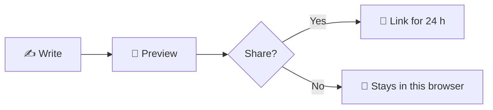
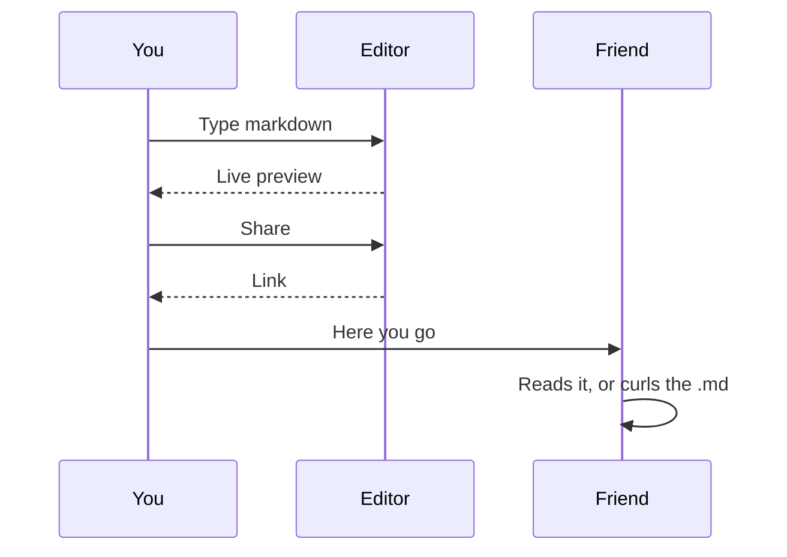

# 👋 Markdown Live Preview

Write on the left, see it on the right. Your text stays in this browser
until you press **Share** 🔗, and then the link lives for **24 hours**.

> [!NOTE]
> This whole page is markdown. Edit anything and watch the preview follow.
> **Reset** brings this tour back.

---

## ✍️ Text

Plain **bold**, *italic*, ***both***, ~~strikethrough~~ and `inline code`.
==Highlighted==, ++inserted++, H~2~O, E = mc^2^, and <kbd>Ctrl</kbd> + <kbd>S</kbd>.

Links work as [text](https://github.com/AiratTop/md.airat.top), and bare ones
too: https://md.airat.top.

Emoji by name :rocket: :tada: :coffee:, or as they are 🌿 ✅ 🧠.

## 📋 Lists

1. Write a draft
2. Check the preview
   - headings, lists, tables
   - code, math, diagrams
     - even nested three deep
3. Share it

### ✅ Tasks

- [x] Live preview
- [x] Code highlighting, math and diagrams
- [x] Share links that delete themselves
- [ ] Your next document

## 📊 Tables

| Feature | Where it works | Notes |
|:--|:--:|--:|
| Live preview | ✅ editor | as you type |
| Sync scroll | ✅ editor | both ways |
| Share link | ✅ 24 hours | `.md` and `.json` too |
| Account | ❌ not needed | — |

## 💻 Code

```javascript
// Fenced code with a language is highlighted.
const share = async (markdown) => {
  const response = await fetch("/api/shares", {
    method: "POST",
    headers: { "Content-Type": "application/json" },
    body: JSON.stringify({ content: markdown }),
  });
  return (await response.json()).url;
};
```

```python
def reading_time(text: str, wpm: int = 200) -> int:
    """Minutes to read, rounded up."""
    return -(-len(text.split()) // wpm)
```

```bash
# Every share has a raw twin, for scripts and models:
curl -s https://md.airat.top/<id>.md
```

## 🧮 Math

Inline, like $e^{i\pi} + 1 = 0$, or on its own line:

$$
\int_{-\infty}^{\infty} e^{-x^2}\,dx = \sqrt{\pi}
\qquad
\sum_{k=1}^{n} k = \frac{n(n+1)}{2}
$$

A dollar next to a digit stays a dollar: coffee is $4 and cake is $6.

## 🧭 Diagrams





## 📚 More

HTML
: Tags like `<kbd>`, `<sub>` and `<details>` work; scripts and styles do not.

Footnotes
: Put a marker in the text[^tour] and the note at the bottom.

<details>
<summary>🎁 Click to open</summary>

Collapsible sections are plain HTML, and markdown works inside them.

</details>

> 💡 **Tip:** quotes can hold anything,
> > even another quote.

Images work as `` or ``, like the Airat.Top icon:


*[HTML]: HyperText Markup Language

---

## 🛡️ Privacy

Editing and preview happen in this browser; the draft is saved in its local
storage. Nothing leaves it until you press **Share**, and a shared link is
readable by anyone who has it, then deleted after 24 hours. No analytics, no
third-party scripts.

[^tour]: Like this one. Footnotes collect at the end of the document.
